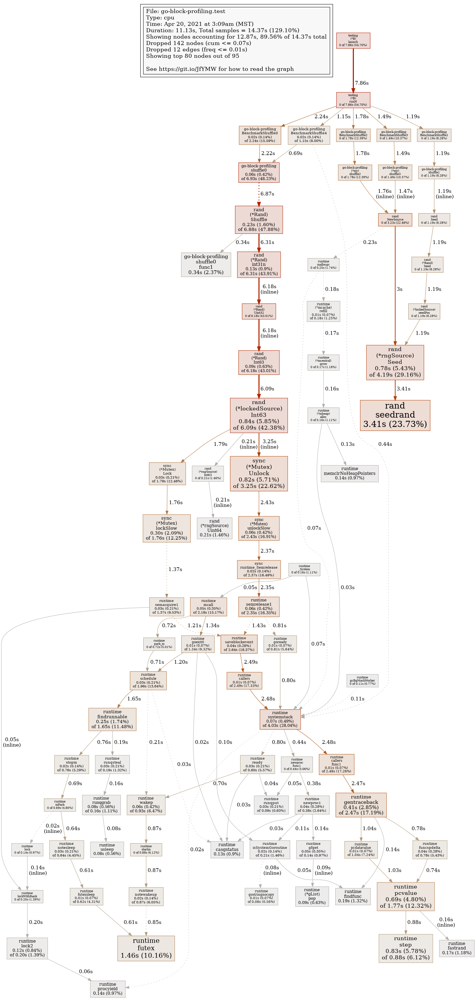
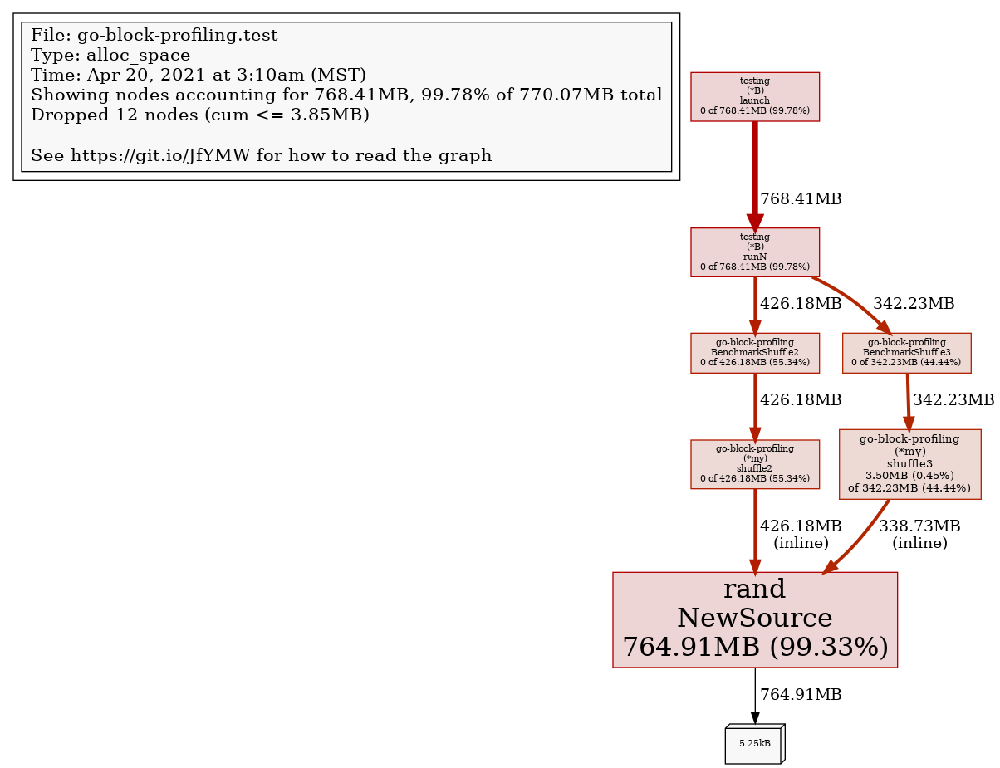
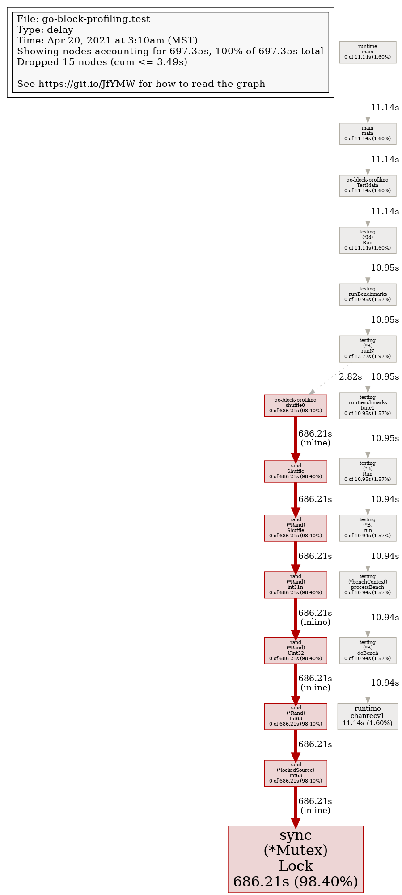
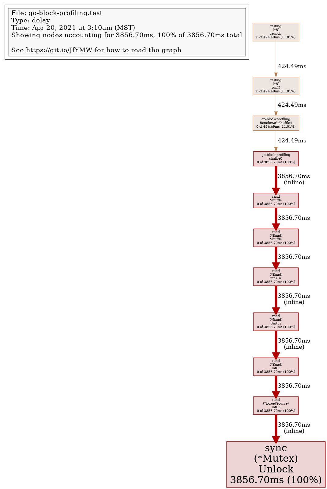

## Predefined profiles provided by the runtime/pprof package


https://golang.org/doc/diagnostics

cpu: CPU profile determines where a program spends its time while actively consuming CPU cycles (as opposed to while sleeping or waiting for I/O).

heap: Heap profile reports memory allocation samples; used to monitor current and historical memory usage, and to check for memory leaks.
threadcreate: Thread creation profile reports the sections of the program that lead the creation of new OS threads.
goroutine: Goroutine profile reports the stack traces of all current goroutines.

block: Block profile shows where goroutines block waiting on synchronization primitives (including timer channels). Block profile is not enabled by default; use runtime.SetBlockProfileRate to enable it.

mutex: Mutex profile reports the lock contentions. When you think your CPU is not fully utilized due to a mutex contention, use this profile. Mutex profile is not enabled by default, see runtime.SetMutexProfileFraction to enable it.


```sh
make
# BenchmarkShuffle0-8     13761372                87.82 ns/op            0 B/op          0 allocs/op
# BenchmarkShuffle1-8        86557             12098 ns/op               0 B/op          0 allocs/op
# BenchmarkShuffle2-8        72139             22491 ns/op            5376 B/op          1 allocs/op
# BenchmarkShuffle3-8        56299             23308 ns/op            5440 B/op          2 allocs/op
# BenchmarkShuffle4-8      1000000              4180 ns/op               2 B/op          0 allocs/op
```

https://github.com/google/pprof/blob/master/doc/README.md#interpreting-the-callgraph





