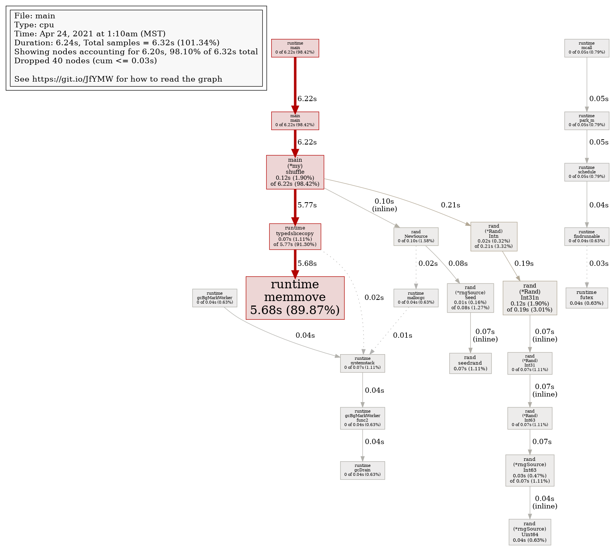
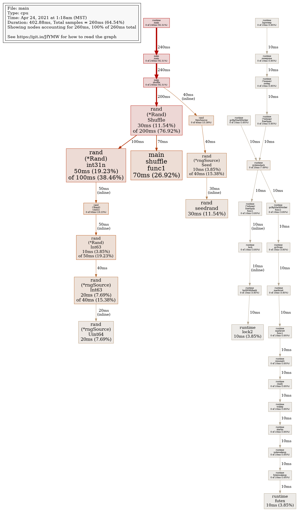
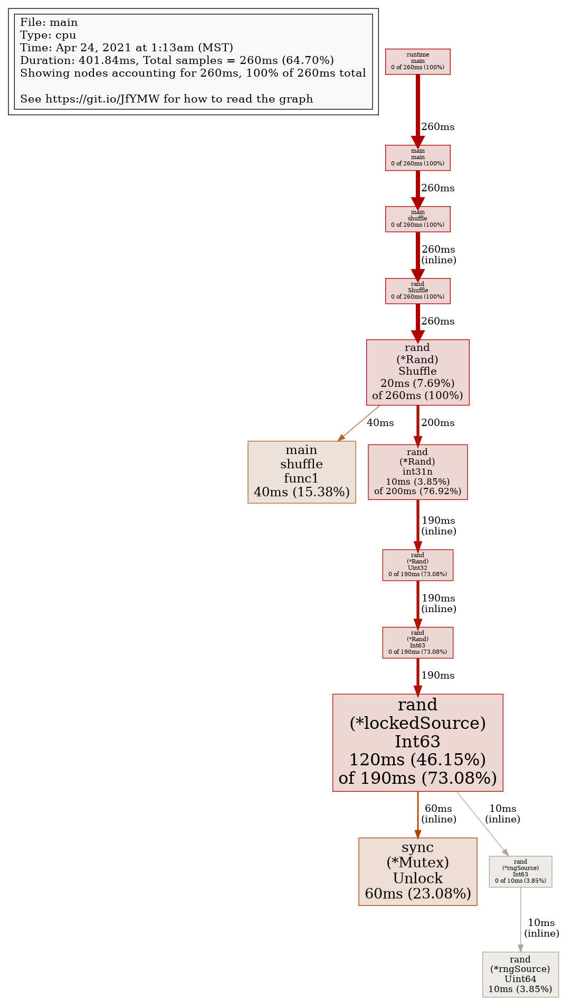
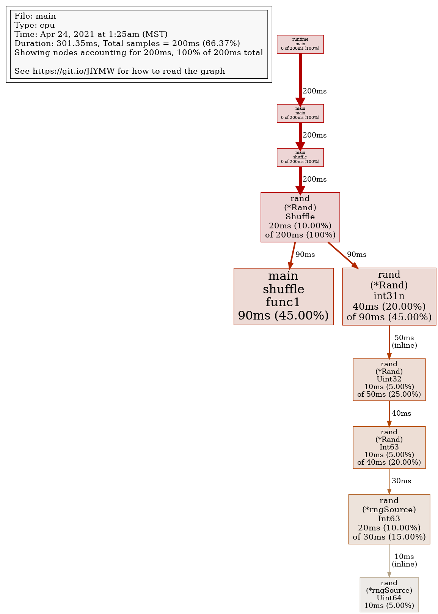

## 1
```go
func (*my) shuffle(a []string) []string {
	r := rand.New(rand.NewSource(time.Now().Unix()))
	result := make([]string, len(a))
	n := len(a)
	for i := 0; i < n; i++ {
		j := r.Intn(len(a))
		result[i] = a[j]
		a = append(a[:j], a[j+1:]...)
	}
	return result
}

type my struct{}
```
Run:
```sh
make
# 6.111793592s
Showing nodes accounting for 6.20s, 98.10% of 6.32s total
Dropped 40 nodes (cum <= 0.03s)
      flat  flat%   sum%        cum   cum%
     5.68s 89.87% 89.87%      5.68s 89.87%  runtime.memmove
     0.12s  1.90% 91.77%      6.22s 98.42%  main.(*my).shuffle
     0.12s  1.90% 93.67%      0.19s  3.01%  math/rand.(*Rand).Int31n
     0.07s  1.11% 94.78%      0.07s  1.11%  math/rand.seedrand (inline)
     0.07s  1.11% 95.89%      5.77s 91.30%  runtime.typedslicecopy
     0.04s  0.63% 96.52%      0.04s  0.63%  math/rand.(*rngSource).Uint64 (inline)
     0.04s  0.63% 97.15%      0.04s  0.63%  runtime.futex
     0.03s  0.47% 97.63%      0.07s  1.11%  math/rand.(*rngSource).Int63
     0.02s  0.32% 97.94%      0.21s  3.32%  math/rand.(*Rand).Intn
     0.01s  0.16% 98.10%      0.08s  1.27%  math/rand.(*rngSource).Seed
         0     0% 98.10%      6.22s 98.42%  main.main
         0     0% 98.10%      0.07s  1.11%  math/rand.(*Rand).Int31 (inline)
         0     0% 98.10%      0.07s  1.11%  math/rand.(*Rand).Int63 (inline)
         0     0% 98.10%      0.10s  1.58%  math/rand.NewSource (inline)
         0     0% 98.10%      0.04s  0.63%  runtime.findrunnable
         0     0% 98.10%      0.04s  0.63%  runtime.gcBgMarkWorker
         0     0% 98.10%      0.04s  0.63%  runtime.gcBgMarkWorker.func2
         0     0% 98.10%      0.04s  0.63%  runtime.gcDrain
         0     0% 98.10%      6.22s 98.42%  runtime.main
         0     0% 98.10%      0.04s  0.63%  runtime.mallocgc
         0     0% 98.10%      0.05s  0.79%  runtime.mcall
         0     0% 98.10%      0.05s  0.79%  runtime.park_m
         0     0% 98.10%      0.05s  0.79%  runtime.schedule
         0     0% 98.10%      0.07s  1.11%  runtime.systemstack
```



## 2

---

```go
func shuffle(a []string) {
	r := rand.New(rand.NewSource(time.Now().Unix()))
	r.Shuffle(len(a), func(i, j int) { a[i], a[j] = a[j], a[i] })
}
```

Run:
```sh
make
# 261.835375ms
Showing nodes accounting for 260ms, 100% of 260ms total
      flat  flat%   sum%        cum   cum%
      70ms 26.92% 26.92%       70ms 26.92%  main.shuffle.func1
      50ms 19.23% 46.15%      100ms 38.46%  math/rand.(*Rand).int31n
      30ms 11.54% 57.69%      200ms 76.92%  math/rand.(*Rand).Shuffle
      30ms 11.54% 69.23%       30ms 11.54%  math/rand.seedrand (inline)
      20ms  7.69% 76.92%       40ms 15.38%  math/rand.(*rngSource).Int63
      20ms  7.69% 84.62%       20ms  7.69%  math/rand.(*rngSource).Uint64 (inline)
      10ms  3.85% 88.46%       50ms 19.23%  math/rand.(*Rand).Int63 (inline)
      10ms  3.85% 92.31%       40ms 15.38%  math/rand.(*rngSource).Seed
      10ms  3.85% 96.15%       10ms  3.85%  runtime.futex
      10ms  3.85%   100%       10ms  3.85%  runtime.lock2
         0     0%   100%      240ms 92.31%  main.main
         0     0%   100%      240ms 92.31%  main.shuffle
         0     0%   100%       50ms 19.23%  math/rand.(*Rand).Uint32 (inline)
         0     0%   100%       40ms 15.38%  math/rand.NewSource (inline)
         0     0%   100%       10ms  3.85%  runtime.(*mheap).freeSpan
         0     0%   100%       10ms  3.85%  runtime.(*mheap).freeSpan.func1
         0     0%   100%       10ms  3.85%  runtime.(*mspan).sweep
         0     0%   100%       10ms  3.85%  runtime.bgsweep
         0     0%   100%       10ms  3.85%  runtime.futexwakeup
         0     0%   100%       10ms  3.85%  runtime.gcBgMarkWorker
         0     0%   100%       10ms  3.85%  runtime.gcBgMarkWorker.func2
         0     0%   100%       10ms  3.85%  runtime.gcDrain
         0     0%   100%       10ms  3.85%  runtime.lock (inline)
         0     0%   100%       10ms  3.85%  runtime.lockWithRank (inline)
         0     0%   100%      240ms 92.31%  runtime.main
         0     0%   100%       10ms  3.85%  runtime.markroot
         0     0%   100%       10ms  3.85%  runtime.markroot.func1
         0     0%   100%       10ms  3.85%  runtime.notewakeup
         0     0%   100%       10ms  3.85%  runtime.ready
         0     0%   100%       10ms  3.85%  runtime.resumeG
         0     0%   100%       10ms  3.85%  runtime.startm
         0     0%   100%       10ms  3.85%  runtime.sweepone
         0     0%   100%       20ms  7.69%  runtime.systemstack
         0     0%   100%       10ms  3.85%  runtime.wakep
```


---

## 3

```go
func shuffle(a []string) {
	rand.Shuffle(len(a), func(i, j int) { a[i], a[j] = a[j], a[i] })
}
```

Run:
```sh
make
# 259.769395ms
Showing nodes accounting for 260ms, 100% of 260ms total
      flat  flat%   sum%        cum   cum%
     120ms 46.15% 46.15%      190ms 73.08%  math/rand.(*lockedSource).Int63
      60ms 23.08% 69.23%       60ms 23.08%  sync.(*Mutex).Unlock (inline)
      40ms 15.38% 84.62%       40ms 15.38%  main.shuffle.func1
      20ms  7.69% 92.31%      260ms   100%  math/rand.(*Rand).Shuffle
      10ms  3.85% 96.15%      200ms 76.92%  math/rand.(*Rand).int31n
      10ms  3.85%   100%       10ms  3.85%  math/rand.(*rngSource).Uint64 (inline)
         0     0%   100%      260ms   100%  main.main
         0     0%   100%      260ms   100%  main.shuffle
         0     0%   100%      190ms 73.08%  math/rand.(*Rand).Int63 (inline)
         0     0%   100%      190ms 73.08%  math/rand.(*Rand).Uint32 (inline)
         0     0%   100%       10ms  3.85%  math/rand.(*rngSource).Int63 (inline)
         0     0%   100%      260ms   100%  math/rand.Shuffle (inline)
         0     0%   100%      260ms   100%  runtime.main
```



---

## 4


```go
func shuffle(r *rand.Rand, a []string) {
	r.Shuffle(len(a), func(i, j int) { a[i], a[j] = a[j], a[i] })
}
```

Run:
```sh
make
# 206.534855ms

Showing nodes accounting for 200ms, 100% of 200ms total
      flat  flat%   sum%        cum   cum%
      90ms 45.00% 45.00%       90ms 45.00%  main.shuffle.func1
      40ms 20.00% 65.00%       90ms 45.00%  math/rand.(*Rand).int31n
      20ms 10.00% 75.00%      200ms   100%  math/rand.(*Rand).Shuffle
      20ms 10.00% 85.00%       30ms 15.00%  math/rand.(*rngSource).Int63
      10ms  5.00% 90.00%       40ms 20.00%  math/rand.(*Rand).Int63
      10ms  5.00% 95.00%       50ms 25.00%  math/rand.(*Rand).Uint32 (inline)
      10ms  5.00%   100%       10ms  5.00%  math/rand.(*rngSource).Uint64 (inline)
         0     0%   100%      200ms   100%  main.main
         0     0%   100%      200ms   100%  main.shuffle
         0     0%   100%      200ms   100%  runtime.main
```


